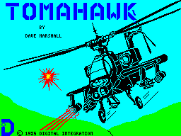
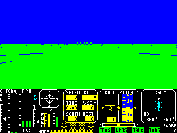
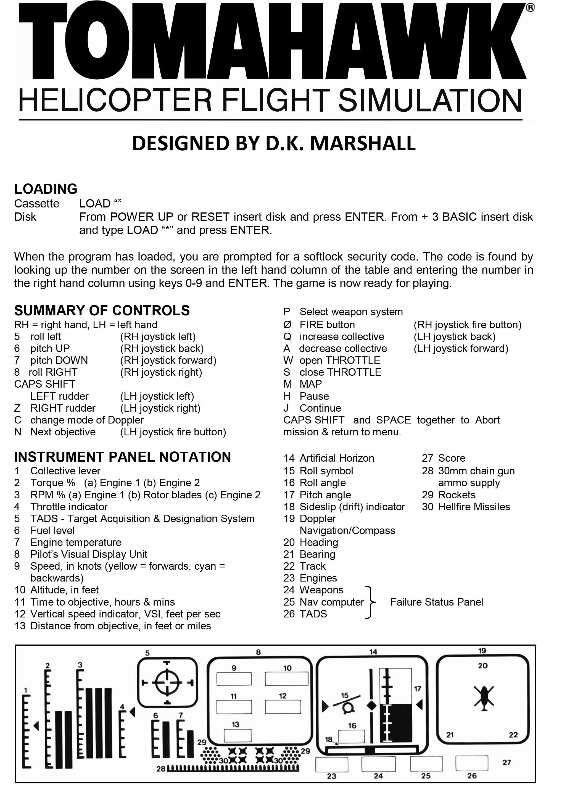

# Playing Tomahawk
How to play Tomahawk today!!

## How to Play

[Play it online!!](http://torinak.com/qaop#!tomahawk) or use Speccy.

Configure **Kempstone Joystick** then use **Arrow Keys** for movement and **ALT** to fire.

## Tips

### Use of DOPPLER MODE: 

key **C** selects between *beacon mode* (**B**), *landing pad mode* (**H**),
*ground attack mode* (**T**) or *air-to-air mode* (**lightning symbol**) on DOPPLER/COMPASS instrument.

key **N** selects "next objective" in each mode:
* 8 beacons (0 to 7)
* 4 landing pads per sector (0 to 3)
* 8 enemy targets per sector (0 to 7)
* 1 enemy helicopter

## References
* [World of Spectrum](http://www.worldofspectrum.org/infoseekid.cgi?id=0005317)
* [Walkthrough](https://www.youtube.com/watch?v=k6NhKnL2Llw)
